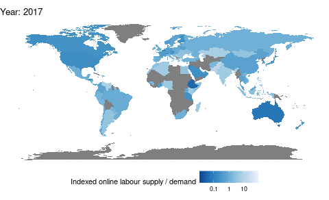

```{r setup, include=FALSE}
library(knitr)
opts_chunk$set(echo = TRUE)
library(here)
library(tidyverse)
library(gganimate)
library(lubridate)
library(transformr)
theme_set(theme_bw())
```

## Creating an animated map plot

Here I make an animated graph showing the increasing online labour outsourcing from developed countries to developing countries. The data consists of data from the OLI ([http://onlinelabourobservatory.org/oli-demand/](http://onlinelabourobservatory.org/oli-demand/); [http://onlinelabourobservatory.org/oli-supply/](http://onlinelabourobservatory.org/oli-supply/)).

The R-code used can be found below.

1. Read data.

```{r, eval=FALSE}
demand <- read.csv(here("oli/bcountrydata_2022-01-09.txt"))
supply <- read.csv(here("oli/worker_countrydata_2022-01-09.txt"))
```

2. Summarize data.

```{r, eval=FALSE}
supply = supply %>% mutate(timestamp = as.Date(timestamp)) %>%
  group_by(country, timestamp) %>%
  summarise(num_workers = sum(num_workers))
demand = demand %>% mutate(timestamp = as.Date(timestamp)) %>%
  group_by(country, timestamp) %>%
  summarise(count = sum(count))
```
3. Wrangle the data a bit more.

```{r, eval=FALSE}
data = inner_join(supply, demand, by = c("country", "timestamp")) %>%
  mutate(country = as.character(country)) %>%
  na.omit()
data = data %>% mutate(year = year(timestamp)) %>%
  filter(year != 2022)

sums = data %>% group_by(timestamp) %>%
  summarise(sum_supply = sum(num_workers),
            sum_demand = sum(count)) %>%
  ungroup()

data = left_join(data, sums, by = "timestamp")

data = data %>%
  mutate(supply = num_workers / sum_supply,
         demand = count / sum_demand) %>%
  group_by(country, year) %>%
  summarise(demand = mean(demand),
            supply = mean(supply))

data = data %>% mutate(net_export = supply/demand)
delete_countries = data %>% filter(is.na(net_export)) %>% select(country) %>%
  distinct() %>% as.list()
data = data %>% filter(!(country %in% delete_countries))
data$country = ifelse(data$country == "United States", "USA", data$country)
data$country = ifelse(data$country == "United Kingdom", "UK", data$country)

data = data %>%
  select(-c(demand, supply)) %>%
  pivot_wider(names_from = year, values_from = net_export, names_prefix = "year_")
```
4. Create the map animation.

```{r, eval=FALSE}
world = map_data("world")
world = world %>% mutate(country = region) %>%
  select(-region)
world = left_join(world, data, by = "country")
world = world %>%
  pivot_longer(cols = 7:ncol(world),
               names_to = "year",
               names_prefix = "year_",
               values_to = "net_export")
world = world %>% mutate(year = as.integer(year))

my_breaks = c(0.1,1,10)
mapplot = world %>%
  ggplot() +
  aes(x = long, y = lat) +
  geom_polygon(aes(group = group, fill = net_export),
               color = "black", size = 0.01) +
  theme_void() +
  theme(legend.position="bottom",
        legend.direction = "horizontal") +
  scale_fill_distiller(name = "Indexed online labour supply / demand",
                        palette = "Blues",
                        trans = "log",
                        breaks = my_breaks,
                        labels = my_breaks) +
  coord_fixed() +
  transition_time(year) +
  labs(title = "Year: {frame_time}")

ani <- animate(mapplot, duration = 3)
ani
```
