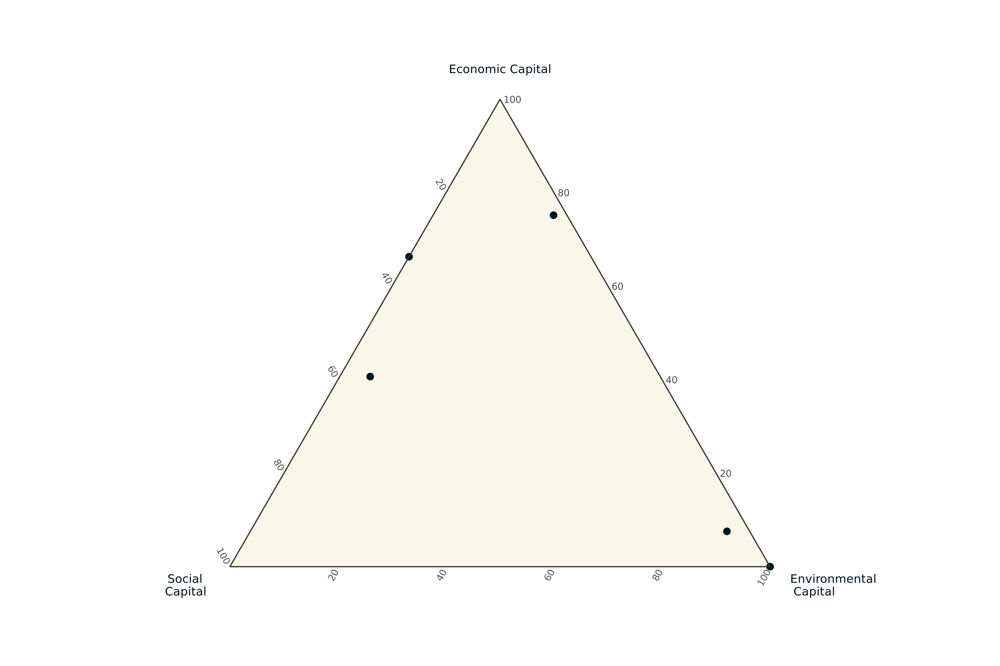

```{r setup, include=FALSE}
knitr::opts_chunk$set(echo = TRUE)

fileConn <- file("header.html")
writeLines('<meta http-equiv="Cache-Control" content="no-cache, no-store, must-revalidate" />
<meta http-equiv="Pragma" content="no-cache" />
<meta http-equiv="Expires" content="0" />', fileConn)
close(fileConn)
```



```{r, results = "asis", echo=FALSE}
cat("
<script>
function loadImage() {
  var d = new Date();
  document.getElementById('image').src = 'ternary.png?rand=' + d.getTime() + '.png';
}
window.onload = function () {
  setInterval(loadImage, 1000); // load image every 1000 milliseconds (1 second)
};
</script>
")
```