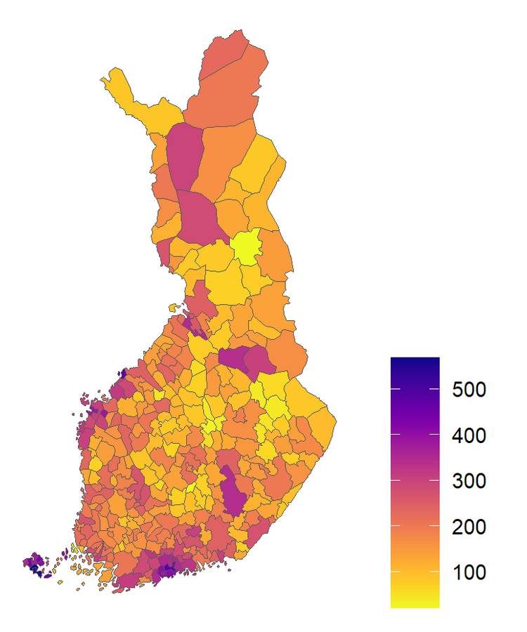

```{r setup, include=FALSE}
#library(flexdashboard)
```
#### Digitally averaged Time magazine covers from 2021.

{width=50%}

#### Total number of positive Covid-19 tests per 1,000 people in Finland by municipality before 2022/3/13.

{width=50%}

Source: THL & Statistics Finland

#### Online worker supply / demand.


Source: http://onlinelabourobservatory.org/

